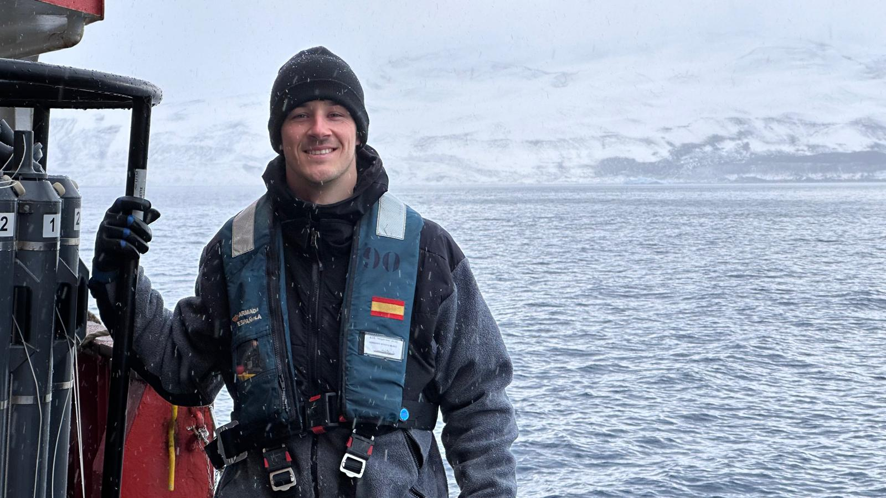
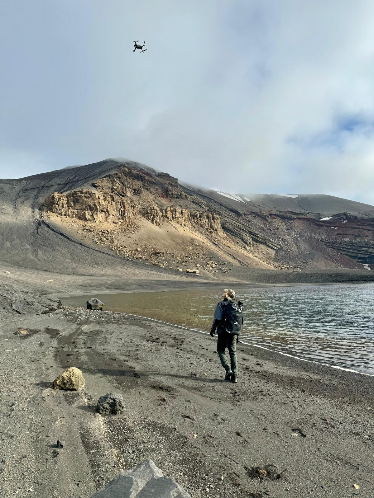

---
resources:
  - countries-110m.json
---

<h1 style="text-align: center;font-family: 'Jost', sans-serif;color: #D9B08C; font-size: 2em; font-weight: bold; margin-bottom: 10px;">
    Thanks for stopping by!
</h1>
<br>
<p style="text-align: justify; color: #D1E8E2; font-size: 1em;">
    Let me introduce myself a bit more, I am Oleg Belyaev, an <strong style="color: #FFCB9A;">Oceanographer and GIS Scientist</strong> with a deep passion for understanding and preserving marine ecosystems. My academic journey, which began with a <strong style="color: #FFCB9A;">Bachelor's degree in Biology</strong> and progressed through a <strong style="color: #FFCB9A;">Master’s in Oceanography</strong>, has led me to specialize in the integration of biogeochemical insights with earth observation techniques. Currently, I am pursuing a <strong style="color: #FFCB9A;">PhD in Marine Science and Technology at Cádiz University</strong>, where my research is focused on the biogeochemistry of Antarctic ecosystems, particularly the dynamic environment of Deception Island.
    
    

    My research experience spans several cutting-edge projects, including the development of satellite-based algorithms for detecting marine heat events and algal blooms, as well as contributions to the Andalusian Marine Observatory. Through these projects, I have honed my skills in <strong style="color: #FFCB9A;">remote sensing and GIS</strong>, working extensively on the application of these technologies to monitor and predict changes in marine environments.
    
    

    Fieldwork is a critical component of my research, and I have had the privilege of participating in the <strong style="color: #FFCB9A;">XXXVII Spanish Antarctic Campaign</strong>, conducting extensive field studies on Deception Island. My work in Antarctica has been particularly rewarding, allowing me to contribute to our understanding of how extreme environments influence marine biogeochemical cycles.
    
    In addition to my scientific endeavors, I am deeply committed to interdisciplinary collaboration and communication, having presented my research at numerous <strong style="color: #FFCB9A;">international conferences</strong> and <strong style="color: #FFCB9A;">co-organized national scientific events</strong>. I am fluent in Spanish, Russian, and English, which has further enabled me to engage with the global scientific community.
    
    Beyond academia, I am passionate about aviation, exploring diverse cultures, engaging in outdoor marine activities, and contributing to <strong style="color: #FFCB9A;">environmental conservation efforts</strong>, including coral restoration projects. I believe that through rigorous research and a commitment to sustainability, we can better understand and protect the vital ecosystems that our planet depends on.
</p>

----
<br>

<p style="text-align: center;"> <span style="color: #D1E8E2;font-size: 1.2em;font-family: 'Jost', sans-serif;"><i class="fas fa-solid fa-map-location-dot" style="color:#FFCB9A;"></i> My research activities were carried out in these locations</span></p>

```{=html}
<div id="globe-wrap">
  <div id="globe"><div id="globe-tip" class="globe-tip"></div></div>
  <div id="globe-legend"><span class="gl-dot"></span>Spain · Antarctica · Ireland · Sweden<span class="gl-hint">drag to spin</span></div>
</div>
<script type="module">
import * as d3 from 'https://cdn.jsdelivr.net/npm/d3@7/+esm';
import * as topojson from 'https://cdn.jsdelivr.net/npm/topojson-client@3/+esm';

const LABELS = {
  'Spain': 'Spain — Cádiz (ICMAN-CSIC)',
  'Ireland': 'Ireland — Marine Institute',
  'Sweden': 'Sweden — Umeå',
  'Antarctica': 'Antarctica — Deception Island'
};
const MARKERS = [
  { name: 'Spain', coords: [-6.29, 36.53] },
  { name: 'Ireland', coords: [-9.05, 53.27] },
  { name: 'Sweden', coords: [20.26, 63.83] },
  { name: 'Antarctica', coords: [-60.66, -62.97] }
];
const COL = {
  ocean: '#1b211e', oceanStroke: 'rgba(17,100,102,0.6)',
  land: 'rgba(209,232,226,0.14)', landStroke: 'rgba(209,232,226,0.22)',
  marked: '#FFCB9A', markedStroke: '#116466',
  graticule: 'rgba(209,232,226,0.08)',
  marker: '#FFCB9A', markerRing: 'rgba(255,203,154,0.35)'
};

const host = document.getElementById('globe');
const tip = document.getElementById('globe-tip');
const data = await fetch('countries-110m.json').then(r => r.json());
const countries = topojson.feature(data, data.objects.countries).features;

let width = Math.min(host.clientWidth || 420, 440), height = width;
const dpr = window.devicePixelRatio || 1;
const canvas = d3.select(host).append('canvas')
  .attr('width', width * dpr).attr('height', height * dpr)
  .style('width', width + 'px').style('height', height + 'px');
const ctx = canvas.node().getContext('2d');
ctx.scale(dpr, dpr);

const projection = d3.geoOrthographic()
  .scale(width / 2 - 2).translate([width / 2, height / 2])
  .rotate([10, -25, 0]).clipAngle(90);
const path = d3.geoPath(projection, ctx);
const graticule = d3.geoGraticule10();

let dragging = false, hovering = false;

function onNearSide(coords) {
  const c = projection.rotate();
  return d3.geoDistance(coords, [-c[0], -c[1]]) < Math.PI / 2;
}
function render() {
  ctx.clearRect(0, 0, width, height);
  ctx.beginPath(); path({ type: 'Sphere' }); ctx.fillStyle = COL.ocean; ctx.fill();
  ctx.beginPath(); path(graticule); ctx.strokeStyle = COL.graticule; ctx.lineWidth = 0.5; ctx.stroke();
  countries.forEach(f => {
    const marked = LABELS.hasOwnProperty(f.properties.name);
    ctx.beginPath(); path(f);
    ctx.fillStyle = marked ? COL.marked : COL.land; ctx.fill();
    ctx.lineWidth = marked ? 0.6 : 0.4;
    ctx.strokeStyle = marked ? COL.markedStroke : COL.landStroke; ctx.stroke();
  });
  ctx.beginPath(); path({ type: 'Sphere' }); ctx.strokeStyle = COL.oceanStroke; ctx.lineWidth = 1; ctx.stroke();
  MARKERS.forEach(m => {
    if (!onNearSide(m.coords)) return;
    const p = projection(m.coords); if (!p) return;
    ctx.beginPath(); ctx.arc(p[0], p[1], 6, 0, 2 * Math.PI); ctx.fillStyle = COL.markerRing; ctx.fill();
    ctx.beginPath(); ctx.arc(p[0], p[1], 3, 0, 2 * Math.PI); ctx.fillStyle = COL.marker; ctx.fill();
  });
}

canvas.call(d3.drag()
  .on('start', () => { dragging = true; host.classList.add('grabbing'); })
  .on('drag', (e) => { const r = projection.rotate(); projection.rotate([r[0] + e.dx * 0.3, Math.max(-90, Math.min(90, r[1] - e.dy * 0.3))]); render(); })
  .on('end', () => { dragging = false; host.classList.remove('grabbing'); }));

let last = Date.now();
d3.timer(() => {
  if (dragging || hovering) { last = Date.now(); return; }
  const now = Date.now(), r = projection.rotate();
  projection.rotate([r[0] + (now - last) * 0.006, r[1]]); last = now; render();
});

canvas.on('mousemove', (e) => {
  const rect = canvas.node().getBoundingClientRect();
  const x = e.clientX - rect.left, y = e.clientY - rect.top;
  let found = null;
  for (const m of MARKERS) { if (!onNearSide(m.coords)) continue; const p = projection(m.coords); if (p && Math.hypot(p[0] - x, p[1] - y) < 11) { found = m; break; } }
  if (found) { hovering = true; tip.textContent = LABELS[found.name]; tip.style.left = (x + 12) + 'px'; tip.style.top = (y + 6) + 'px'; tip.style.opacity = 1; }
  else { hovering = false; tip.style.opacity = 0; }
});
canvas.on('mouseleave', () => { hovering = false; tip.style.opacity = 0; });

window.addEventListener('resize', () => {
  const w = Math.min(host.clientWidth || 420, 440);
  if (Math.abs(w - width) < 2) return;
  width = w; height = w;
  canvas.attr('width', width * dpr).attr('height', height * dpr).style('width', width + 'px').style('height', height + 'px');
  ctx.setTransform(1, 0, 0, 1, 0, 0); ctx.scale(dpr, dpr);
  projection.scale(width / 2 - 2).translate([width / 2, height / 2]); render();
});

render();
window.__globeReady = { markers: MARKERS.length, countries: countries.length };
</script>
```

