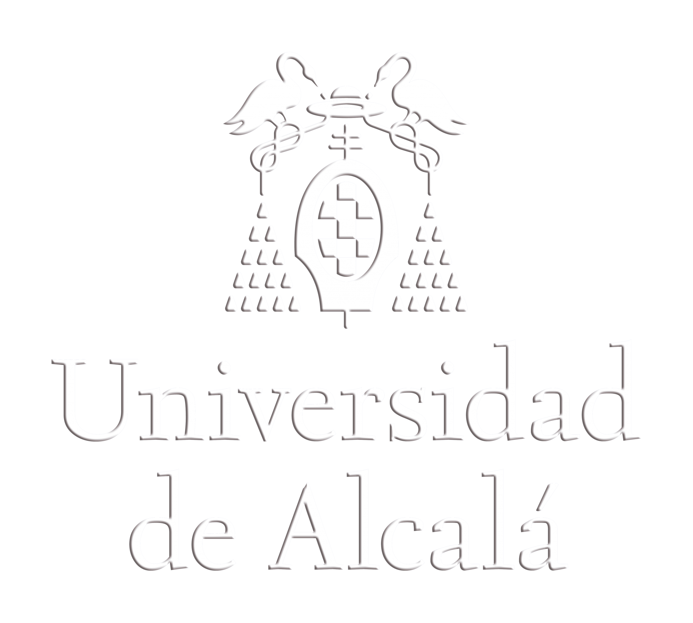

<h1 style="color: #D9B08C;text-align: center;font-family: 'Jost', sans-serif;">Education</h1>

---

##  <i class="fas fa-graduation-cap" style="color:#FFCB9A;"></i> PhD in Marine Science and Technology 

  
Cádiz University, Spain

  
  
Antarctic Biogeochemistry and Remote Sensing research.

  
  
  
  
January 2024 – ongoing

  
  <ul style="font-size: 0.9em; color: #D1E8E2;">
    <li>Antarctic Biogeochemistry and Remote Sensing research.</li>
  </ul>

---

## <i class="fas fa-graduation-cap" style="color:#FFCB9A;"></i> MSc in Oceanography

  
Cadiz University - ICMAN-CSIC, Spain

  
September 2020 – September 2021

  
  
Deep understanding of biological, physical, chemical and geological 
  processes in coastal oceanic systems.

  
  
Courses included:

  
  
  
  <ul style="font-size: 0.9em; color: #D1E8E2;">
    <li>Physical, chemical, ecological and geological oceanography</li>
  </ul>

---

## <i class="fas fa-graduation-cap" style="color:#FFCB9A;"></i> BSc Molecular Biology (Erasmus+)

  
Umeå University, Sweden

  
September 2018 – September 2019

  
  

    Advanced molecular biology and genetics laboratory techniques.
  

  
Courses included:

  
  
  
  <ul style="font-size: 0.9em; color: #D1E8E2;">
    <li>Molecular Genetics</li>
    <li>Neurobiology</li>
    <li>Microbiology</li>
  </ul>

---

## <i class="fas fa-graduation-cap" style="color:#FFCB9A;"></i> BSc in Biology

  
Alcala University, Spain

  
September 2015 – September 2018

  
  

    Understanding of the basic structures and dynamics 
    of living organisms and their interactions with their environment.
  

  
  

<h1 style="color: #D9B08C;text-align: center;font-family: 'Jost', sans-serif;">Courses</h1>

---

##  <i class="fas fa-graduation-cap" style="color:#FFCB9A;"></i> PhD Course in spatial data analysis in ecology with R

  
Cádiz University, Spain

  
October 2024

  
  <ul style="font-size: 0.9em;color:#D1E8E2">
      <li>Built foundational skills in spatial analysis using GIS data concepts and R setup for data visualization, cleaning, and GPS data import.</li>
      <li>Applied space-use analysis (MCP, KDE) and trajectory segmentation (EMBC, HMM) to study movement patterns and behaviors in R.</li>
      <li>Conducted habitat modeling by integrating GPS and environmental data, building and validating habitat suitability models in R.</li>
      <li>20 hours</li>
  </ul>

 

##  <i class="fas fa-graduation-cap" style="color:#FFCB9A;"></i> Expert in Data Science

  
Datamecum

  
August 2025 - April 2026

  
  <ul style="font-size: 0.9em;color:#D1E8E2">
      <li>Comprehensive training in the data science lifecycle, utilizing Python for data manipulation, cleaning, and analysis (Pandas, NumPy).</li>
      <li>Applied machine learning algorithms and statistical modeling techniques to extract actionable insights from complex datasets.</li>
      <li>Developed proficiency in data visualization and storytelling to communicate findings effectively.</li>
      <li>200 hours</li>
  </ul>

 

