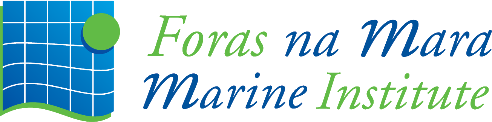

<h1 style="color: #D9B08C;text-align: center;font-family: 'Jost', sans-serif;">Research Experience</h1>

---

## <i class="fas fa-briefcase" style="color:#FFCB9A;"></i><i class="fas fa-graduation-cap" style="color:#FFCB9A; margin-left: 10px;"></i> PhD in Marine Science and Technology

  
ICMAN-CSIC, Cádiz, Spain

  

  
  
  

  
January 2024 – ongoing

  
  
Antarctic Biogeochemistry and Remote Sensing research.

---

## <i class="fas fa-briefcase" style="color:#FFCB9A;"></i> Remote Sensing Scientist - Marine Strategies Project

  
ICMAN-CSIC, Cádiz, Spain

  

  
  
  

  
May 2023 – December 2023

  
  
Responsibilities include:

  <ul style="font-size: 0.9em;color:#D1E8E2">
      <li>Worked on satellite-based algorithms for the detection of marine heat events.</li>
      <li>Continued the development of the Andalusian Marine Observatory.</li>
  </ul>

---

## <i class="fas fa-briefcase" style="color:#FFCB9A;"></i> Remote Sensing Scientist -  Project 

  
ICMAN-CSIC & Marine Institute, Galway, Ireland

  

  
  
  
  
  
  

  
August 2022 – March 2023

  
  
Responsibilities include:

  <ul style="font-size: 0.9em;color:#D1E8E2">
      <li>Collaboration at Galway’s Marine Institute within the framework of the EuroSea project for the development of an observation and warning system for risks derived from extreme marine events.</li>
  </ul>

---

## <i class="fas fa-briefcase" style="color:#FFCB9A;"></i> Remote Sensing Scientist - Sat4Algae Project

  
ICMAN-CSIC

  

  
  
  

  
November 2021 – July 2022

  
  
Responsibilities include:

  <ul style="font-size: 0.9em;color:#D1E8E2">
      <li>Generated satellite tools for the detection of algal blooms, focusing on both macroalgae and microalgae.</li>
    <li>Contributed to the development of the Andalusian Marine Observatory as part of the Sat4Algae project.</li>
    <li>Collaborated in multidisciplinary teams to enhance satellite-based environmental monitoring capabilities.</li>
  </ul>

---

