<h1 style="color: #D9B08C; text-align: center; font-family: 'Jost', sans-serif;">Fieldwork Gallery</h1>

<p class="fdwk-intro">Some of the moments from the XXXVII Spanish Antarctic Campaign. Click any photo to open it larger. All images authored by Oleg Belyaev.</p>

```{=html}
<div class="fdwk-gallery">
<figure class="fdwk-item" data-full="gallery/fdwk-01.jpg">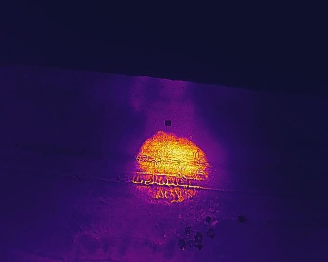<span class="fdwk-zoom"><i class="fas fa-magnifying-glass-plus"></i></span></figure>
<figure class="fdwk-item" data-full="gallery/fdwk-02.jpg">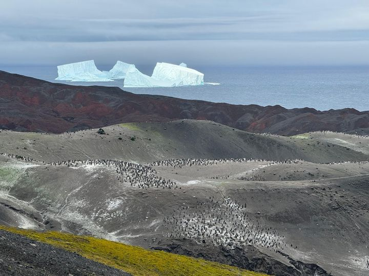<span class="fdwk-zoom"><i class="fas fa-magnifying-glass-plus"></i></span></figure>
<figure class="fdwk-item" data-full="gallery/fdwk-03.jpg">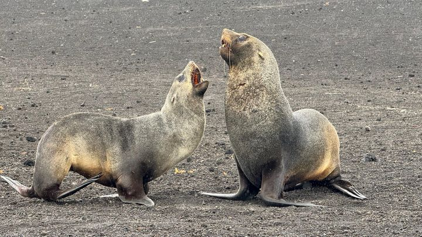<span class="fdwk-zoom"><i class="fas fa-magnifying-glass-plus"></i></span></figure>
<figure class="fdwk-item" data-full="gallery/fdwk-04.jpg">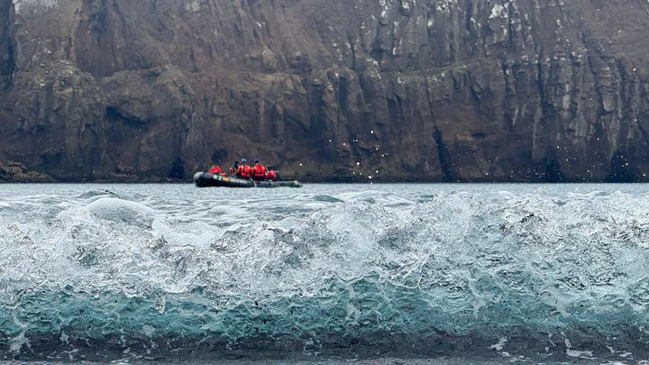<span class="fdwk-zoom"><i class="fas fa-magnifying-glass-plus"></i></span></figure>
<figure class="fdwk-item" data-full="gallery/fdwk-05.jpg">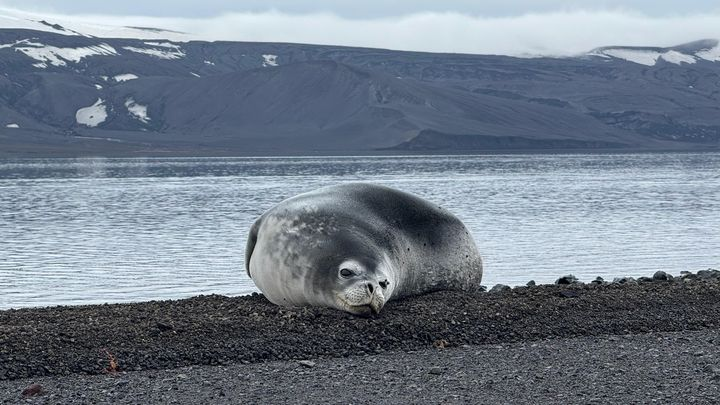<span class="fdwk-zoom"><i class="fas fa-magnifying-glass-plus"></i></span></figure>
<figure class="fdwk-item" data-full="gallery/fdwk-06.jpg">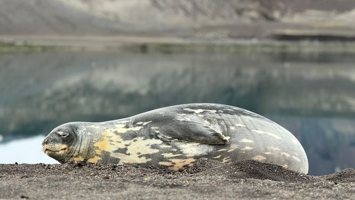<span class="fdwk-zoom"><i class="fas fa-magnifying-glass-plus"></i></span></figure>
<figure class="fdwk-item" data-full="gallery/fdwk-07.jpg">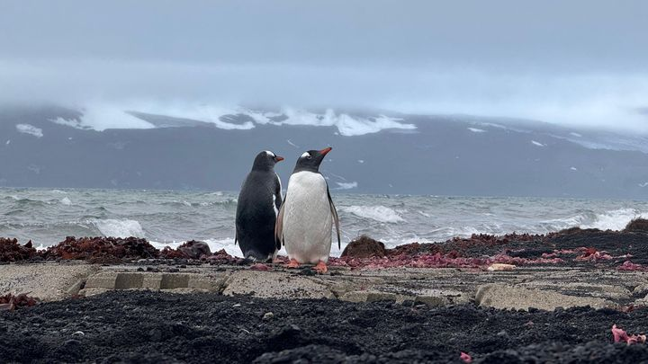<span class="fdwk-zoom"><i class="fas fa-magnifying-glass-plus"></i></span></figure>
<figure class="fdwk-item" data-full="gallery/fdwk-08.jpg">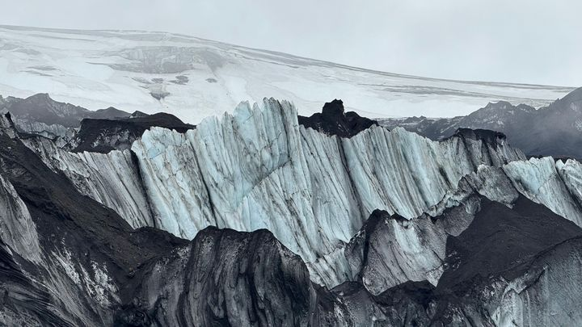<span class="fdwk-zoom"><i class="fas fa-magnifying-glass-plus"></i></span></figure>
<figure class="fdwk-item" data-full="gallery/fdwk-09.jpg">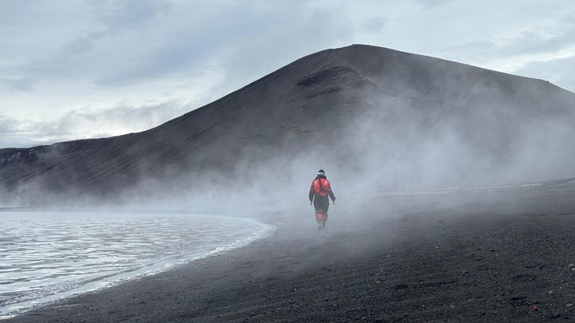<span class="fdwk-zoom"><i class="fas fa-magnifying-glass-plus"></i></span></figure>
<figure class="fdwk-item" data-full="gallery/fdwk-10.jpg">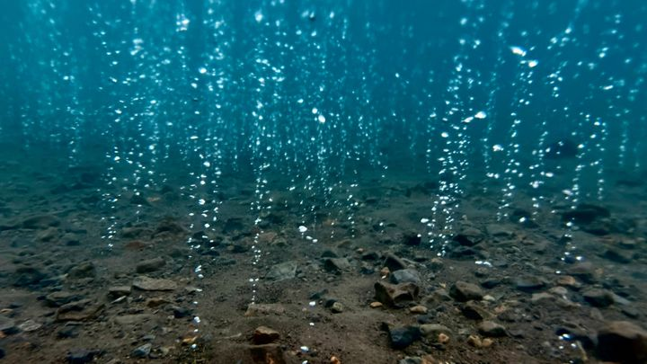<span class="fdwk-zoom"><i class="fas fa-magnifying-glass-plus"></i></span></figure>
<figure class="fdwk-item" data-full="gallery/fdwk-11.jpg">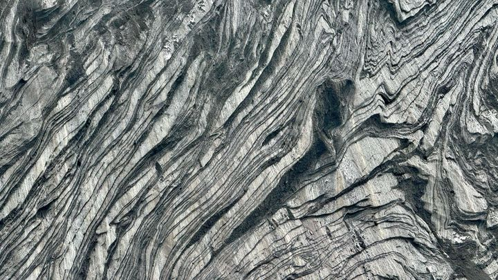<span class="fdwk-zoom"><i class="fas fa-magnifying-glass-plus"></i></span></figure>
<figure class="fdwk-item" data-full="gallery/fdwk-12.jpg">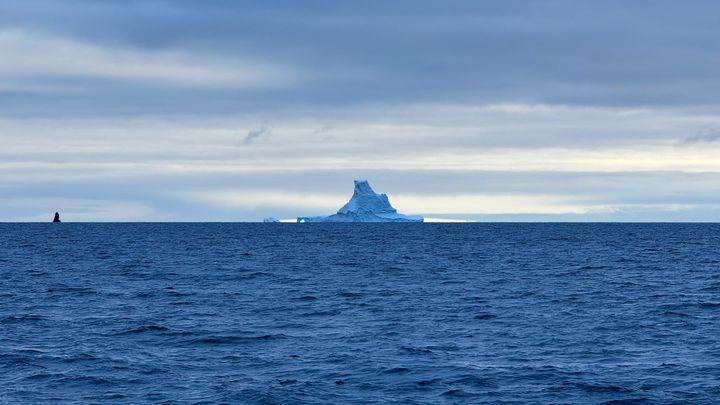<span class="fdwk-zoom"><i class="fas fa-magnifying-glass-plus"></i></span></figure>
<figure class="fdwk-item" data-full="gallery/fdwk-13.jpg">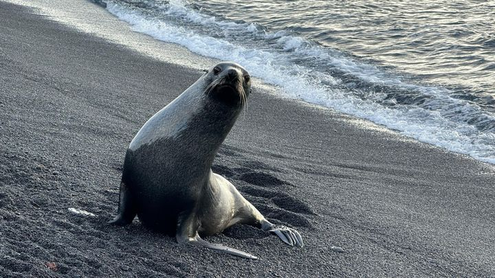<span class="fdwk-zoom"><i class="fas fa-magnifying-glass-plus"></i></span></figure>
<figure class="fdwk-item" data-full="gallery/fdwk-14.jpg">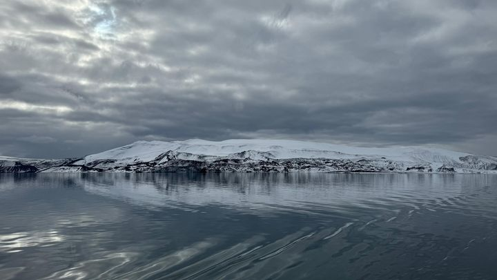<span class="fdwk-zoom"><i class="fas fa-magnifying-glass-plus"></i></span></figure>
<figure class="fdwk-item" data-full="gallery/fdwk-15.jpg">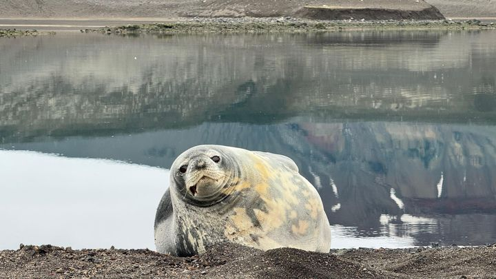<span class="fdwk-zoom"><i class="fas fa-magnifying-glass-plus"></i></span></figure>
<figure class="fdwk-item" data-full="gallery/fdwk-16.jpg">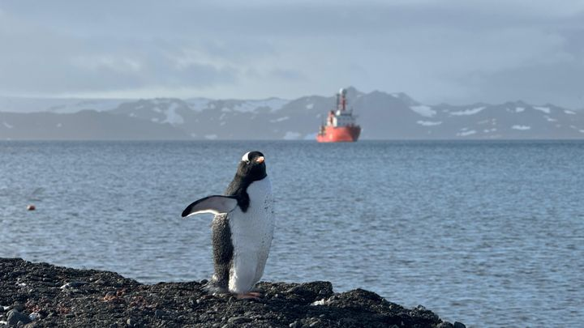<span class="fdwk-zoom"><i class="fas fa-magnifying-glass-plus"></i></span></figure>
<figure class="fdwk-item" data-full="gallery/fdwk-17.jpg">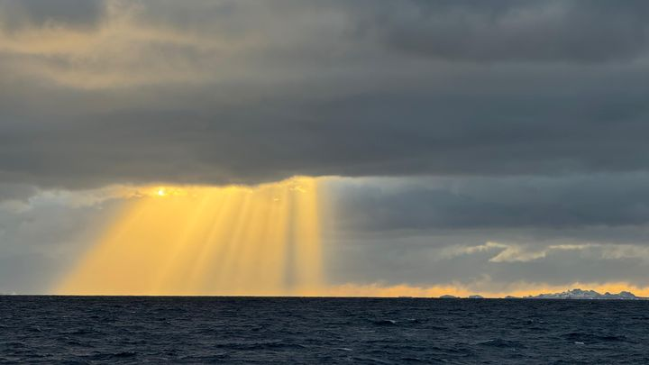<span class="fdwk-zoom"><i class="fas fa-magnifying-glass-plus"></i></span></figure>
</div>

<div class="fdwk-lightbox" id="fdwk-lightbox" aria-hidden="true">
<button class="fdwk-lb-close" type="button" aria-label="Close">&times;</button>
<button class="fdwk-lb-nav fdwk-lb-prev" type="button" aria-label="Previous photo"><i class="fas fa-chevron-left"></i></button>

<div class="fdwk-lb-cap"></div>
<div class="fdwk-lb-count"></div>
<button class="fdwk-lb-nav fdwk-lb-next" type="button" aria-label="Next photo"><i class="fas fa-chevron-right"></i></button>
</div>

<script>
(function () {
  // EDIT HERE: one description per photo, in order. Leave "" for no caption.
  var captions = [
    "Thermal anomaly at Fumarole Bay, Deception Island, captured using a DJI Mavic 2 Enterprise UAV. The DICHOSO project team can be seen below the anomaly.", // fdwk-01
    "Vapour Col penguin colony, a chinstrap penguin (Pygoscelis antarcticus) breeding site located at the south-west of the island, seen in this photo from the hill leading to the site. Captured using an iPhone 15 Pro Max, 120mm f2,8.", // fdwk-02
    "A pair of sea lions playing near in the vicinity of Kronen Lake. Captured using an iPhone 15 Pro Max, 120mm f2,8. ", // fdwk-03
    "Members of the DICHOSO team installing a moored oceanographic instrumentation at Neptune Bellows, the passage that connects Port Foster inner bay with the Bransfield Strait. Captured using an iPhone 15 Pro Max, 120mm f2,8.", // fdwk-04
    "A gray furred Weddell seal (Leptonychotes weddellii) laying peacefully in the vicinity of Telephon Bay. Captured using an iPhone 15 Pro Max, 120mm f2,8.", // fdwk-05
    "A golden furred Weddell seal (Leptonychotes weddellii) laying peacefully in the vicinity of Telephon Bay, close to the gray furred one from the previous image. Captured using an iPhone 15 Pro Max, 120mm f2,8.", // fdwk-06
    "A pair of gentoo penguins (Pygoscelis papua) in front of the Gabriel de Castilla Spanish Antarctic Base. Captured using an iPhone 15 Pro Max, 120mm f2,8.", // fdwk-07
    "Top ice sheet of the Black Glacier, in the eastern rim of Port Foster. Captured using an iPhone 15 Pro Max, 120mm f2,8.", // fdwk-08
    "A member of the DICHOSO team can be seen emerging from the emanating water vapour from the boiling shore water at Pendulum Cove, north of the Port Foster caldera. Captured using an iPhone 15 Pro Max, 120mm f2,8.", // fdwk-09
    "Hydrothermal gas escaping in the form of bubbles from the seafloor of Fumarole Bay. Captured by briefly and kinda recklessly submerging a caseless iPhone 15 Pro Max in about a meter of freezing water. 24mm f1,78.", // fdwk-10
    "This image is one of my favourites. Black glacier, featuring bends and faults as the ones that can be seen in regular geological formations. The black incursions correspond so ancient ash deposition, creating a mesmerizing and unique pattern. Captured using an iPhone 15 Pro Max, 120mm f2,8.", // fdwk-11
    "An ice cathedral. A huge iceberg featuring an impressive arch can be seen in the distance, shot in the vicinity of Deception Island, on board the R/V Hespérides. Captured using an iPhone 15 Pro Max, 120mm f2,8.", // fdwk-12
    "A playful sea lion staring at the camera at Baily Head's shore, in the outer rim of Deception Island's east coast. Captured using an iPhone 15 Pro Max, 120mm f2,8.", // fdwk-13
    "Eastern inner rim of Port Foster as seen from the R/V Hespérides in a calm day. Captured using an iPhone 15 Pro Max, 120mm f2,8.", // fdwk-14
    "A front look at the golden furred Weddell seal (Leptonychotes weddellii) laying peacefully in the vicinity of Telephon Bay, close to the gray furred one from the previous image. Captured using an iPhone 15 Pro Max, 120mm f2,8.", // fdwk-15
    "A gentoo penguin (Pygoscelis papua) shaking its wings with the R/V Hespérides anchored in the background. King George Island. Captured using an iPhone 15 Pro Max, 120mm f2,8.", // fdwk-16
    "God's hand. A mesmerizing Antarctic sunlight gets through the thick cloud layer, illuminating the dark ocean. Captured using an iPhone 15 Pro Max, 120mm f2,8.", // fdwk-17
  ];
  var items = Array.prototype.slice.call(document.querySelectorAll(".fdwk-item"));
  var lb = document.getElementById("fdwk-lightbox");
  if (!lb || !items.length) return;
  var img = lb.querySelector(".fdwk-lb-img");
  var cap = lb.querySelector(".fdwk-lb-cap");
  var count = lb.querySelector(".fdwk-lb-count");
  var idx = 0;
  function show(i) {
    idx = (i + items.length) % items.length;
    var el = items[idx];
    img.src = el.getAttribute("data-full");
    var c = captions[idx] || "";
    img.alt = c;
    cap.textContent = c;
    cap.style.display = c ? "block" : "none";
    count.textContent = (idx + 1) + " / " + items.length;
  }
  function open(i) { show(i); lb.classList.add("open"); document.body.style.overflow = "hidden"; }
  function close() { lb.classList.remove("open"); document.body.style.overflow = ""; img.src = ""; }
  items.forEach(function (el, i) { el.addEventListener("click", function () { open(i); }); });
  lb.querySelector(".fdwk-lb-close").addEventListener("click", close);
  lb.querySelector(".fdwk-lb-prev").addEventListener("click", function (e) { e.stopPropagation(); show(idx - 1); });
  lb.querySelector(".fdwk-lb-next").addEventListener("click", function (e) { e.stopPropagation(); show(idx + 1); });
  lb.addEventListener("click", function (e) { if (e.target === lb) close(); });
  document.addEventListener("keydown", function (e) {
    if (!lb.classList.contains("open")) return;
    if (e.key === "Escape") close();
    else if (e.key === "ArrowLeft") show(idx - 1);
    else if (e.key === "ArrowRight") show(idx + 1);
  });
})();
</script>
```
