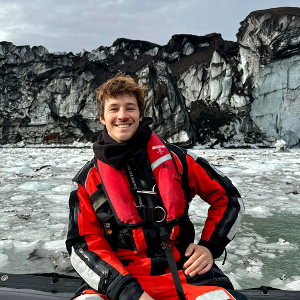

<video autoplay muted loop playsinline id="myVideo"><source src="img/videoback3.mp4" type="video/mp4"></video>

Oleg Belyaev

Oceanographer &amp; GIS Scientist

PhD student at ICMAN-CSIC

<a href="mailto:mail.o.belyaev@csic.es"><i class="fas fa-envelope"></i></a> <a href="https://x.com/OlegBelyaevK" target="_blank"><i class="fab fa-square-x-twitter"></i></a> <a href="https://github.com/obkorolev" target="_blank"><i class="fab fa-github"></i></a> <a href="https://www.linkedin.com/in/olegbelyaevkorolev/" target="_blank"><i class="fab fa-linkedin"></i></a> <a href="https://www.researchgate.net/profile/Oleg-Korolev-2" target="_blank"><i class="fab fa-researchgate"></i></a> <a href="https://scholar.google.co.uk/citations?user=M7wfOdwAAAAJ&hl=en" target="_blank"><i class="fab fa-google-scholar"></i></a> <a href="https://orcid.org/0000-0002-8851-2996" target="_blank"><i class="fab fa-orcid"></i></a>

Welcome to my website! Having grown up among two different cultures and languages allowed me to obtain a global vision and develop critical thinking, acquiring great ability in problem approaching and solving. Graduated in <strong>Biology</strong> and with a <strong>MSc in Coastal Oceanography</strong>, I am currently enrolled in a <strong>PhD program in Antarctic biogeochemistry research and earth observation</strong> in the DICHOSO project framework, at the Institute of Marine Sciences of Andalusia (CSIC).

<a class="cv-btn" id="cv-preview-btn" role="button" tabindex="0">Preview CV</a> <a class="cv-btn cv-btn-outline" href="cv/CV_2025_OBK.pdf" download>Download CV</a>

<section class="cv-preview" id="cv-preview" data-pdf="cv/CV_2025_OBK.pdf">
<iframe class="cv-frame" title="Curriculum Vitae of Oleg Belyaev" src=""></iframe><a class="cv-btn" href="cv/CV_2025_OBK.pdf" download>Download CV</a>
</section>

