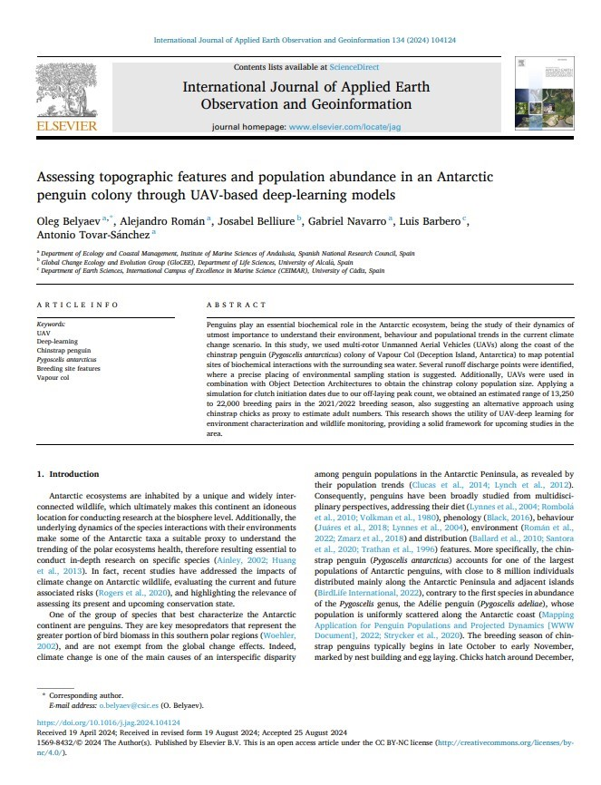
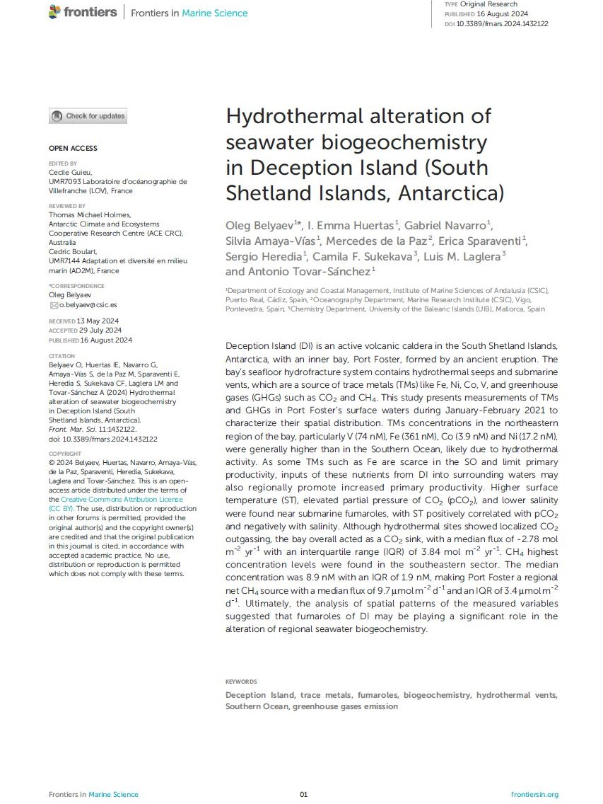
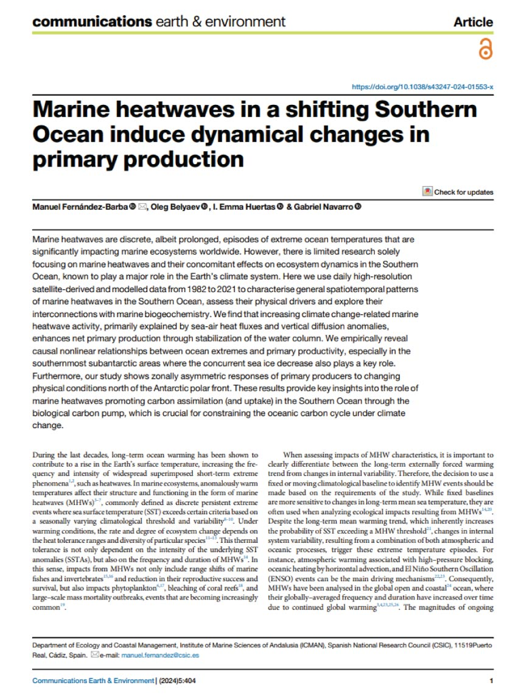
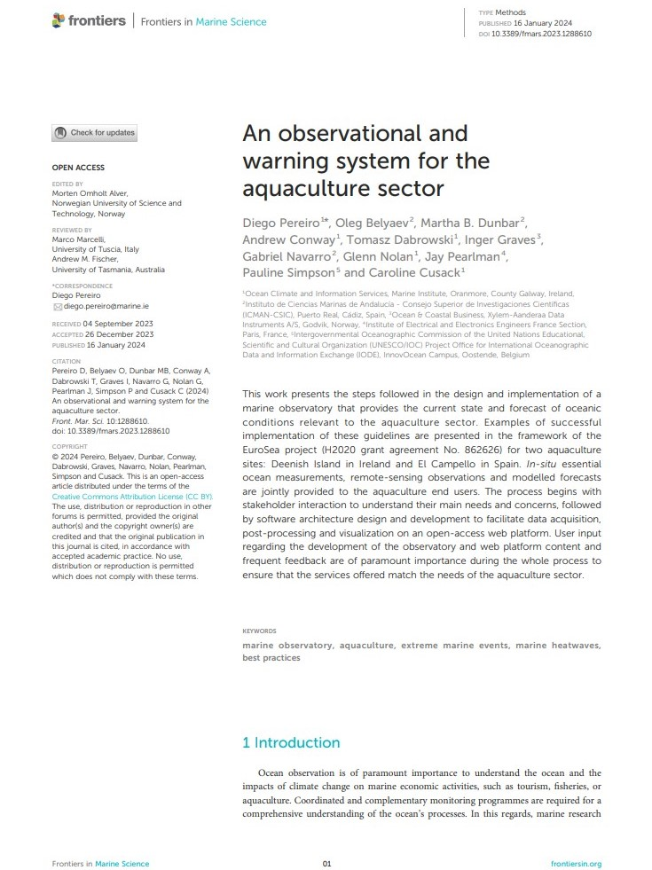
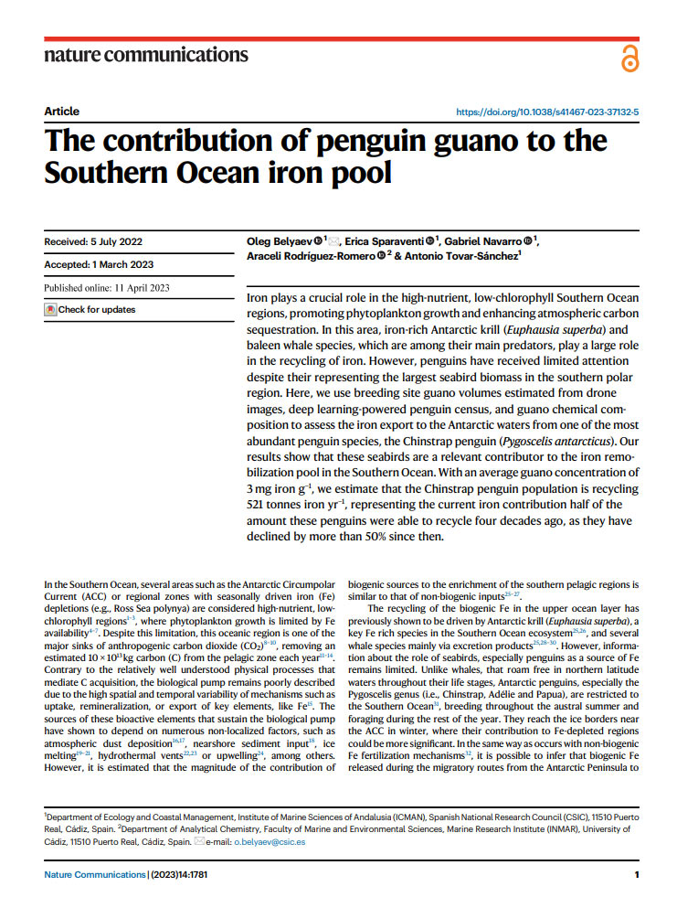

<h1 style="color: #D9B08C; text-align: center;font-family: 'Jost', sans-serif;">Research</h1>

----

```{=html}
<div class="research-layout">
<div class="research-timeline">
<div class="rt-node" data-paper="5"><span class="rt-dot"></span><span class="rt-date">Sep 2024</span></div>
<div class="rt-node" data-paper="4"><span class="rt-dot"></span><span class="rt-date">Aug 2024</span></div>
<div class="rt-node" data-paper="3"><span class="rt-dot"></span><span class="rt-date">Jul 2024</span></div>
<div class="rt-node" data-paper="2"><span class="rt-dot"></span><span class="rt-date">Jan 2024</span></div>
<div class="rt-node" data-paper="1"><span class="rt-dot"></span><span class="rt-date">Apr 2023</span></div>
</div>
<div class="research-grid">
<a class="research-card" data-paper="5" href="paper_5.qmd"><div class="rc-thumb"></div><div class="rc-body"><div class="rc-meta">2024 · Int. J. Appl. Earth Obs. Geoinf.</div><div class="rc-title">Assessing topographic features and population abundance in an antarctic penguin colony through UAV-based deep-learning models</div><div class="rc-authors"><strong>O. Belyaev</strong>, A. Román, J. Belliure, G. Navarro, L. Barbero, A. Tovar-Sánchez</div></div></a>
<a class="research-card" data-paper="4" href="paper_4.qmd"><div class="rc-thumb"></div><div class="rc-body"><div class="rc-meta">2024 · Frontiers in Marine Science</div><div class="rc-title">Hydrothermal alteration of seawater biogeochemistry in Deception Island (South Shetland Islands, Antarctica)</div><div class="rc-authors"><strong>O. Belyaev</strong>, I. E. Huertas, G. Navarro, S. Amaya-Vías, M. de la Paz, E. Sparaventi, et al.</div></div></a>
<a class="research-card" data-paper="3" href="paper_3.qmd"><div class="rc-thumb"></div><div class="rc-body"><div class="rc-meta">2024 · Communications Earth &amp; Environment</div><div class="rc-title">Marine heatwaves in a shifting Southern Ocean induce dynamical changes in primary production</div><div class="rc-authors">M. Fernández-Barba, <strong>O. Belyaev</strong>, I. E. Huertas, G. Navarro</div></div></a>
<a class="research-card" data-paper="2" href="paper_2.qmd"><div class="rc-thumb"></div><div class="rc-body"><div class="rc-meta">2024 · Frontiers in Marine Science</div><div class="rc-title">An observational and warning system for the aquaculture sector</div><div class="rc-authors">D. Pereiro, <strong>O. Belyaev</strong>, M. B. Dunbar, A. Conway, T. Dabrowski, et al.</div></div></a>
<a class="research-card" data-paper="1" href="paper_1.qmd"><div class="rc-thumb"></div><div class="rc-body"><div class="rc-meta">2023 · Nature Communications</div><div class="rc-title">The contribution of penguin guano to the Southern Ocean iron pool</div><div class="rc-authors"><strong>O. Belyaev</strong>, E. Sparaventi, G. Navarro, A. Rodríguez-Romero, A. Tovar-Sánchez</div></div></a>
</div>
</div>
<script>
(function(){
  var nodes = {};
  document.querySelectorAll('.research-timeline .rt-node[data-paper]').forEach(function(n){ nodes[n.dataset.paper] = n; });
  document.querySelectorAll('.research-card[data-paper]').forEach(function(card){
    var node = nodes[card.dataset.paper];
    if(!node) return;
    card.addEventListener('mouseenter', function(){ node.classList.add('rt-active'); });
    card.addEventListener('mouseleave', function(){ node.classList.remove('rt-active'); });
    node.addEventListener('mouseenter', function(){ card.classList.add('rc-active'); });
    node.addEventListener('mouseleave', function(){ card.classList.remove('rc-active'); });
  });
})();
</script>
```
