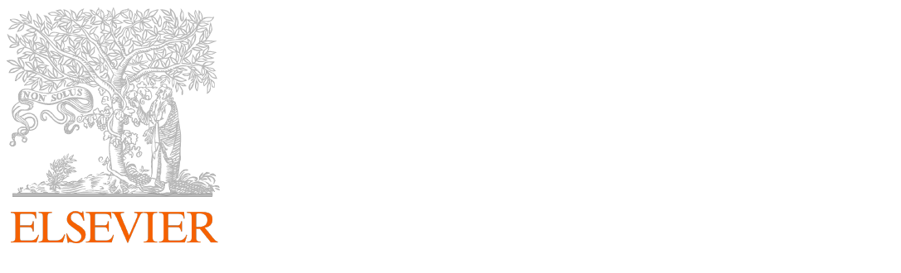

<style>
  /* Contenedor de la imagen */
  .hero-container {
    width: 100%;
    text-align: center; /* Centra el contenido dentro del contenedor */
  }
  
  /* Imagen de fondo sin tintado */
  .hero-image {
    width: 100%;
    height: auto; /* Mantiene la proporción original de la imagen */
    object-fit: cover;
  }
  
  /* Estilo del título del artículo */
  .article-title {
    color: #D1E8E2; /* Color del texto del título */
    font-size: 1.5em; /* Ajusta el tamaño del texto según sea necesario */
    font-family: Jost; /* Fuente sans-serif */
    margin-top: 20px; /* Espacio entre la imagen y el título */
    text-align: center; /* Centra el texto */
  }
</style>

<!-- Título del artículo como enlace al DOI -->
<div class="article-title">
  <a href="https://doi.org/10.1016/j.jag.2024.104124" style="color: #D1E8E2; font-family: 'Jost', sans-serif;text-decoration: none;">
    Assessing topographic features and population abundance in an antarctic penguin colony through UAV-based deep-learning models
  </a>
</div>

<p style="text-align: center;">
  
</p>


<div style="text-align: center;">
  <span style="font-size: 0.9em; color: #D9B08C">
  <strong>Oleg Belyaev</strong>, Alejandro Román, Josabel Belliure, Gabriel Navarro, Luis Barbero & Antonio Tovar-Sánchez.

----
   
<iframe src="pdfs/5_Assessing topographic features and population abundance in an Antarctic penguin colony through UAV-based deep-learning models.pdf" width="100%" height="800"></iframe>
   

```{=html}
<p style="text-align: center; margin: 30px;">
    <a href="/publications/index.qmd" style="color: #D9B08C; text-decoration: underline; font-size: 1em; font-weight: bold;">
        Back to publications
    </a>
</p>
```